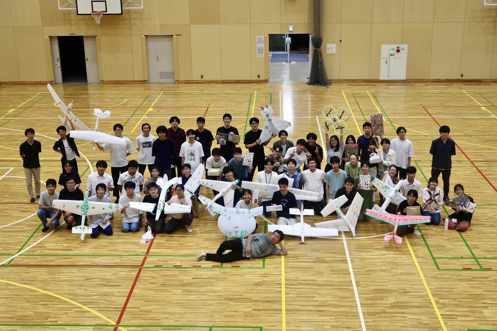

# 東京農工大学 航空研究会

2024年度部内大会集合写真

## このOrganizationについて

東京農工大学航空研究会で使用しているGitHub Organizationです。

2022年度ごろから、飛行ロボットコンテストで使用したコードや、種子島ロケットコンテストで使用したコードなどを公開しています。

また、部内で使用しているライブラリも公開しています。

[サークルHPはこちら](https://web.tuat.ac.jp/~birdman/)

## 使用について

- ライセンスが明記されているものについては、ライセンスに従って使用いただけます
- ライセンスが記載されていないものについては、使用することができません
  - 付けていないだけの場合もあるので、公式X等にお問い合わせください
  
[公式Xはこちら](https://x.com/tuatbm)

## 公開しているライブラリについて

このOrganizationでは多くのライブラリを公開しています！

主にSTM32やESP32等のマイコン向けのものがほとんどですが、

ハードウェア依存部分を抽象化しているものもあるので、他のマイコンでも使用できる可能性があります。
